# Desktop app Computer Use usability audit — 2026-08-10

## Result

The normal desktop experience is broadly stable and usable. The core Job Finder and Interview Helper journeys completed in a real, freshly built Electron app at both 1440×920 and 1366×768. Header navigation stayed centered, native Windows controls worked, independent scroll regions followed the pointer, resume editing/export/approval completed, application preparation stopped before final submit, and an Interview Helper session completed through Review.

No P0 release blocker was found. The thirteen recorded follow-ups were remediated in the local 2026-08-11 integration pass. Focused regression coverage now protects the state, copy, lifecycle, placement, persistence, and discovery semantics described below. A fresh normal-resolution production-Electron replay is the visual closeout gate. Live provider/network availability remains an external environment check: the product now classifies and presents those failures honestly, but deterministic QA cannot prove that the user's original `fetch failed` transport is available.

## Audit environment

| Field            | Value                                                                                                                                                                                                                                             |
| ---------------- | ------------------------------------------------------------------------------------------------------------------------------------------------------------------------------------------------------------------------------------------------- |
| Run              | 2026-08-10 23:08–23:39 CEST (Europe/Budapest)                                                                                                                                                                                                     |
| Branch           | `agent/job-finder-production-second-pass`                                                                                                                                                                                                         |
| Commit           | `8f8eabb29a7187b9e21cc1df99bfb62b243da1d9`                                                                                                                                                                                                        |
| Starting tree    | Clean; ignored QA evidence and isolated runtime data were created during the pass                                                                                                                                                                 |
| App under test   | Fresh Electron Vite production build, launched through the local Electron runtime; this was not an installer/package smoke                                                                                                                        |
| Host             | Windows build `26200.8973`, display version `25H2`                                                                                                                                                                                                |
| Captured desktop | 1920×1032 usable capture area, 100% Windows scaling                                                                                                                                                                                               |
| App windows      | 1440×920 primary baseline and 1366×768 common-laptop window                                                                                                                                                                                       |
| Electron zoom    | 1.0                                                                                                                                                                                                                                               |
| Theme            | Dark                                                                                                                                                                                                                                              |
| Workspace        | Isolated synthetic `Alex Vanguard` profile; never the real user workspace                                                                                                                                                                         |
| Runtime safety   | Browser agent off, live AI off, ATS writes off, final-submit authority false, deterministic test API on                                                                                                                                           |
| Evidence         | 98 raw Computer Use captures retained locally; 39 accepted screenshots promoted under `docs/audits/assets/desktop-app-computer-use-usability-2026-08-10/`, including seven user follow-up captures and eight remediation captures from 2026-08-11 |

The full-width shell remained balanced at the baseline window. The brand is left-aligned, the Job Finder/Interview Helper switch and route categories are centered against the window, and Windows minimize/maximize/close controls stay on the right.

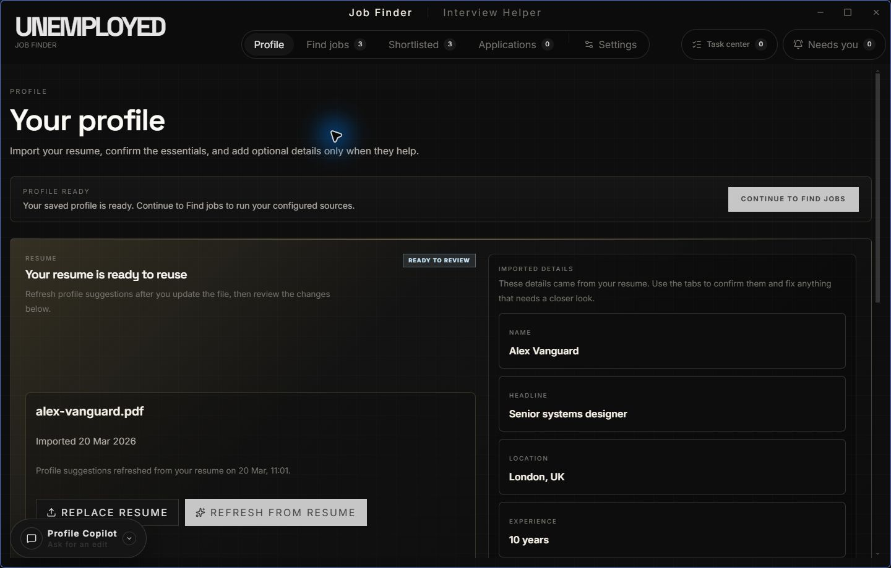

At 1366×768, the same shell remained readable and unclipped.

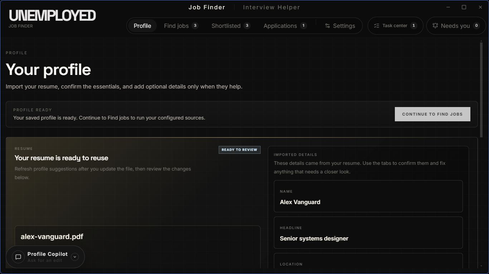

The maximized 1920×1032 layout also kept the two navigation lanes centered independently of the left brand and right Windows controls.

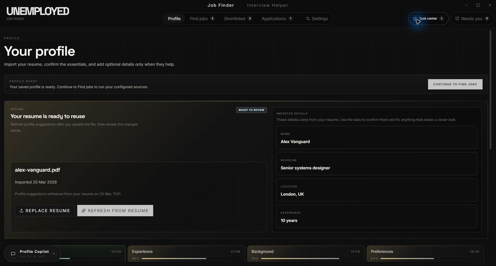

## Coverage summary

| Surface                     | Result             | Evidence and notes                                                                                                                                                                                                                     |
| --------------------------- | ------------------ | -------------------------------------------------------------------------------------------------------------------------------------------------------------------------------------------------------------------------------------- |
| Job Finder shell            | Pass               | Profile/Find jobs/Shortlisted/Applications/Settings/Needs you, Task Center, module switch, route titles, Escape close, minimize/maximize/restore                                                                                       |
| Profile                     | Pass with findings | Established profile, four tabs, Profile Copilot open/Escape close, outer and form-pane scrolling; user follow-up findings CUU-007 through CUU-009                                                                                      |
| Find jobs                   | Pass with findings | Isolated deterministic search, three selections, details, Not interested open/cancel, pointer-specific pane scrolling; live user-run failures CUU-011 and CUU-012                                                                      |
| Shortlisted                 | Pass with finding  | Three job states and cross-pane selection worked; stale validation feedback is documented as CUU-001                                                                                                                                   |
| Resume Studio               | Pass with finding  | Preview-led edit, unsaved preview, save, Guided Edits open/Escape close, clean PDF export and approval; blocked-validation feedback is CUU-001                                                                                         |
| Applications                | Pass with finding  | Safe preparation, filters, row/detail synchronization, run history, recovery, Task Center; contradictory attachment copy is CUU-002                                                                                                    |
| Needs you                   | Pass               | Empty state and safety wording were clear                                                                                                                                                                                              |
| Settings                    | Pass               | CV/default template/workspace behavior/assets/runtime/diagnostics/reset presentation; no destructive action taken                                                                                                                      |
| Interview Setup             | Pass               | Allow → quick check → start with mic/system audio/screenshots intentionally off                                                                                                                                                        |
| Interview Assist            | Pass with findings | Typed question, grounded response, transcript, pause/resume, popup state, end; CUU-004 and CUU-005 remain                                                                                                                              |
| Interview Review            | Pass with findings | End → Review, annotation controls, destructive confirmation cancel; CUU-003 and CUU-006 remain                                                                                                                                         |
| Exported PDF                | Pass               | One-page Letter PDF, 68,113 bytes, no JavaScript/encryption, visually rendered and inspected                                                                                                                                           |
| Transparent popup visuals   | Partial            | Computer Use captured the transparent always-on-top windows as blank/underlying pixels. Their answer/transcript content and controls were verified through the Windows accessibility tree, but visual styling needs a short human look |
| macOS title bar             | Not run            | Windows-only host; macOS traffic-light spacing remains covered by code/tests rather than this visual pass                                                                                                                              |
| External/authenticated work | Not run by design  | No credentials, MFA/CAPTCHA, account creation, sign-in, live employer page, final submit, or employer-owned final control                                                                                                              |
| Real media                  | Not run by design  | No microphone, system audio, screenshot consent, or personal image was used                                                                                                                                                            |

## Findings

| ID      | Severity | Surface                     | State | Fix direction                                                                                      |
| ------- | -------- | --------------------------- | ----- | -------------------------------------------------------------------------------------------------- |
| CUU-001 | P1       | Resume Studio / Shortlisted | Fixed | Validation is job-scoped; blocked export is disabled with a direct proof-review action             |
| CUU-002 | P1       | Applications                | Fixed | Summary and recovery derive from the retained attachment result                                    |
| CUU-003 | P1       | Interview Assist            | Fixed | Ended sessions show intentional Start new interview / Review last session actions                  |
| CUU-004 | P2       | Interview popups            | Fixed | Native popup close reconciles saved visibility and health snapshots                                |
| CUU-005 | P2       | Interview health            | Fixed | Opted-out audio is Off by choice and a functioning typed session is Text-only ready                |
| CUU-006 | P3       | Interview Review            | Fixed | `typed_question` remains source-accurate through Review, annotations, cues, and export             |
| CUU-007 | P2       | Profile Copilot             | Fixed | Ordinary grounded questions receive direct advisory answers without requiring an edit              |
| CUU-008 | P1       | Profile Copilot placement   | Fixed | Launcher/panel measures and clears the visible Profile action footer                               |
| CUU-009 | P3       | Profile Copilot placement   | Fixed | Right docking uses a consistent 16 px safe inset                                                   |
| CUU-010 | P3       | Discovery browser window    | Fixed | Valid user-adjusted browser bounds/state persist in the managed browser profile                    |
| CUU-011 | P1       | Discovery search runtime    | Fixed | All-source interpretation failure is failed; partial safe work survives and failed sources retry   |
| CUU-012 | P1       | Source check runtime        | Fixed | Failed checks do not refresh guidance and retained provenance names the earlier successful check   |
| CUU-013 | P1       | Discovery readiness         | Fixed | A valid source is required; explicit titles are optional and profile-inferred scope is inspectable |

## Remediation verification — 2026-08-11

- Resume Studio computes blocking unsupported/generated-claim counts for the active draft, disables both exports, exposes a visible explanation and proof-review control, and scopes Shortlisted action feedback to the job that produced it.
- Applications uses one negative attachment-outcome predicate across summary and recovery, so a prepared-but-not-attached CV cannot also be described as attached.
- Interview Assist removes Pause/Resume/End after a session ends; native popup close updates overlay preference state; text-only health ignores deliberately disabled media; and typed questions retain their explicit source discriminator.
- Profile Copilot answers the exact ordinary target-role question from grounded profile evidence, remains proposal-first for mutations, docks 16 px from the right edge, and dynamically clears the visible Profile action footer. Native button activation no longer consumes the following pointer click.
- The managed discovery browser restores validated user bounds and native window state from its isolated profile rather than forcing the first-launch footprint on every run.
- Discovery requires an enabled valid source but no longer requires an explicit user-entered target title. Empty role input produces an inspectable profile-derived scope from saved roles, experience titles, and headline while preserving preferences/exclusions.
- A required zero-result interpretation failure cannot complete as an ordinary empty-market result. All-source failure is failed; successful work in a mixed run remains retained; failed targets remain identifiable for exact retry.
- A failed source-debug attempt cannot create, replace, or re-date saved guidance. The UI explicitly identifies retained guidance as coming from the earlier successful verification.

The regression matrix covers these behaviors across Desktop, Contracts, Job Finder, Browser Runtime, AI Providers, and Interview Helper. The production replay uses a synthetic isolated profile and keeps browser-agent work, live AI, credentials, real media, ATS writes, and final submit disabled. Consequently, CUU-011 and CUU-012 product semantics are fixed, while the availability of the user's configured live provider/network path still needs an external recheck.

The normal-window replay confirms that the Copilot launcher and expanded panel clear the Profile save footer, the exact ordinary question receives a grounded direct answer, and an empty explicit-role list is presented as profile-inferred search rather than a blocker.

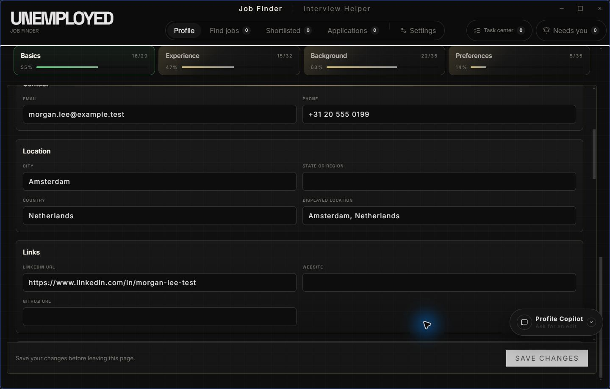

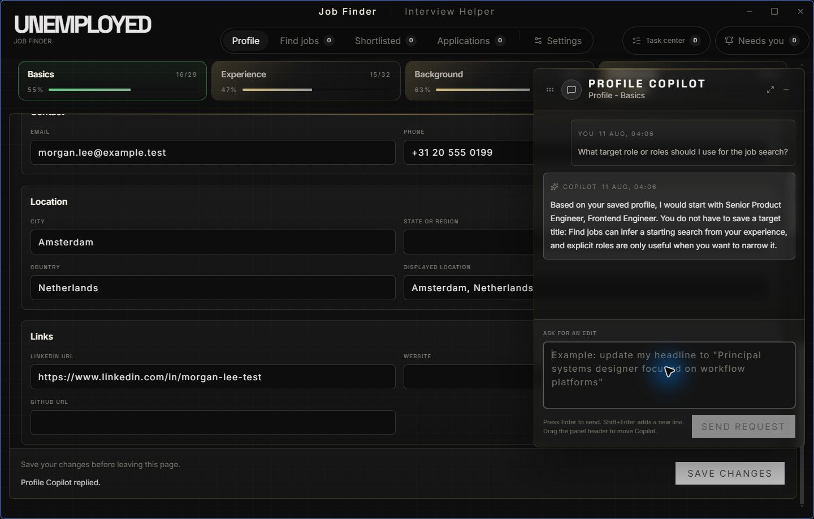

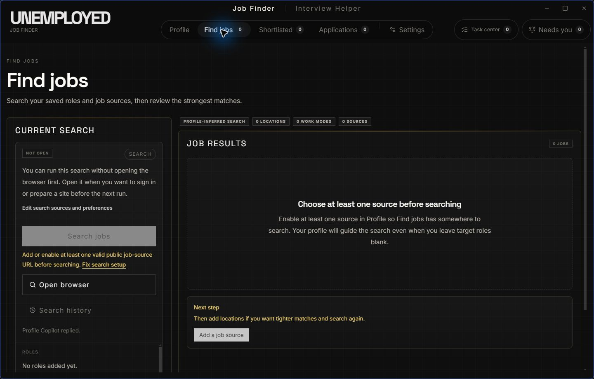

The Interview replay confirms `Text-only ready` with both audio inputs `Off by choice`, preserves `Typed question` in live transcript and Review, reconciles a native popup close to a hidden preference, and replaces stale ended-session controls with intentional next actions. The first production replay exposed one remaining hard-coded chat-source value; that value and its service regression were corrected, the app was rebuilt, and the successful Review/ended-state captures below come from the corrected bundle.

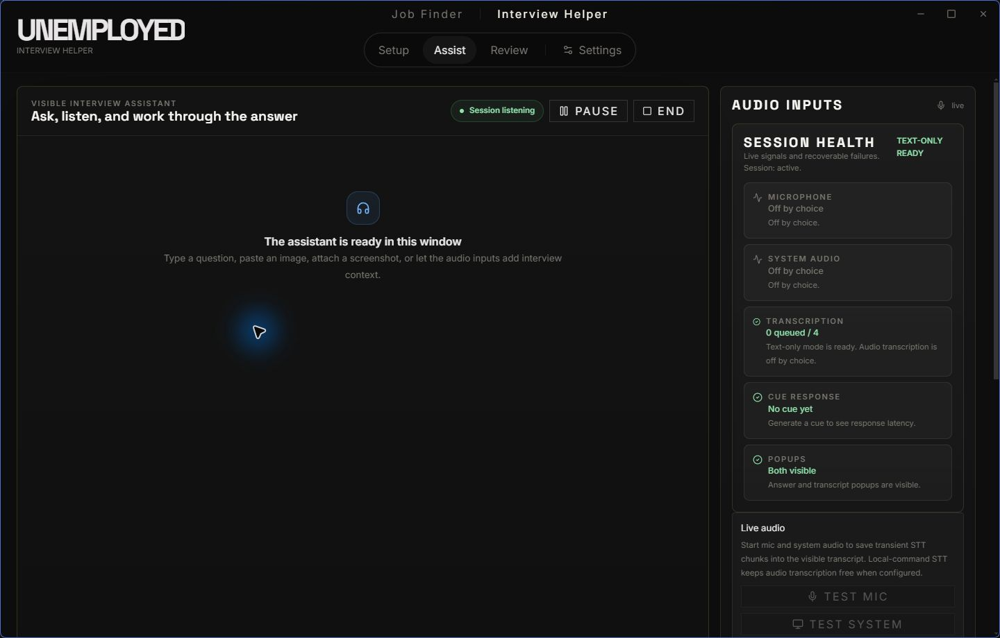

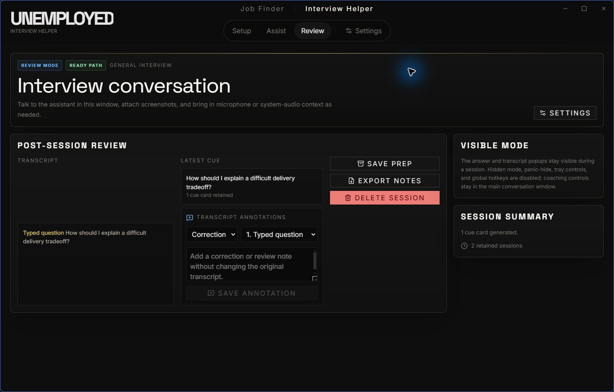

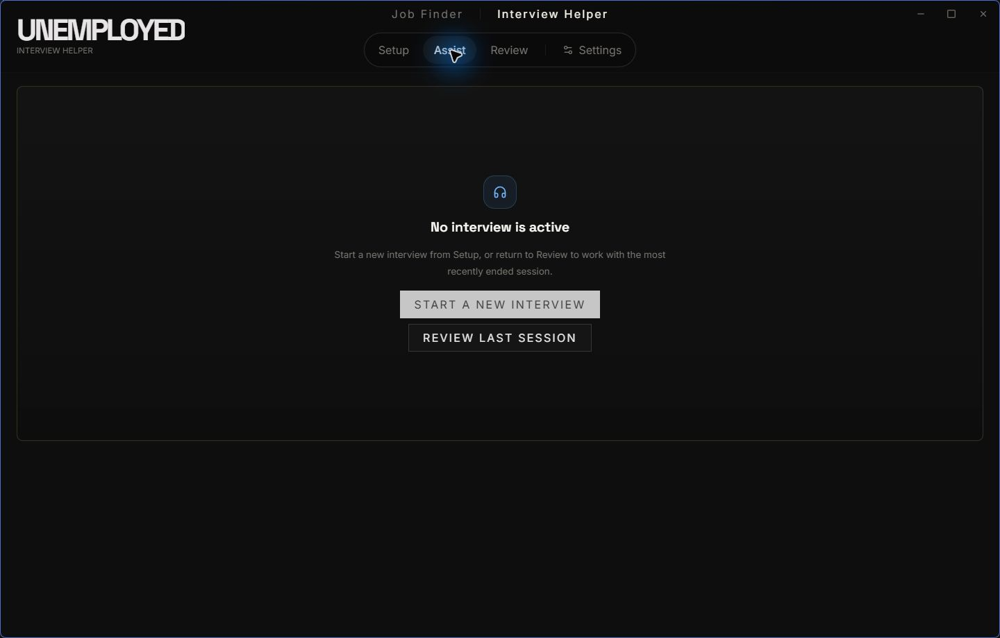

### CUU-001 — resume validation feedback is late and leaks to another job

**Severity:** P1

**Owner:** Desktop renderer Resume Studio/Shortlisted state and candidate-claim validation presentation

After a valid manual Summary edit on Staff Product Designer, saving succeeded and the live preview updated. The page still presented active-looking `Export review PDF` and `Export PDF` controls. Three mouse/keyboard export attempts left the workflow at step 2 with no inline error, no toast, and no explanation beyond a warning count and a section labeled `Résumé proof details (optional)`.

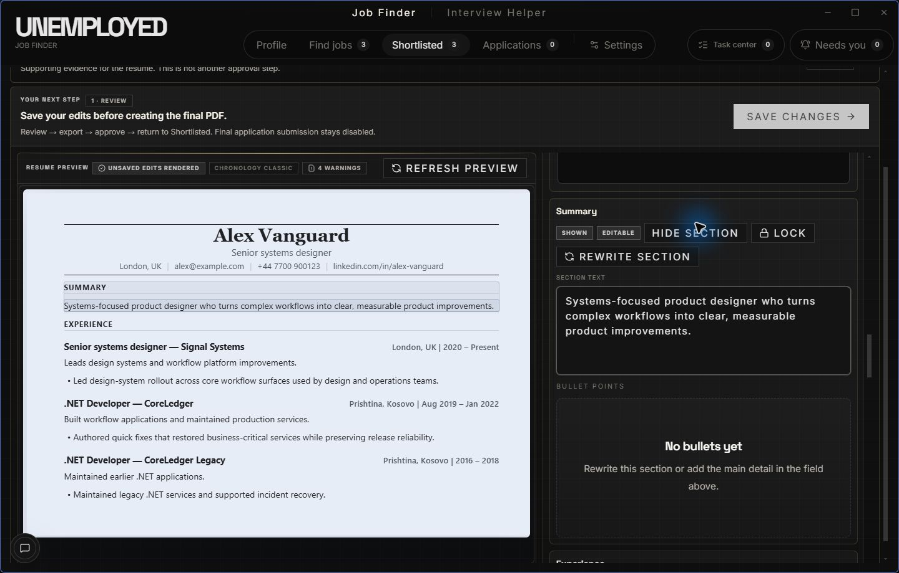

After returning to Shortlisted, the Staff row finally showed `Resume issue`. However, selection had moved to the ready Senior Product Designer and its readiness pane displayed `This resume has blocking candidate-claim validation issues and cannot be exported yet` above an enabled `Prepare application` action. The action worked, confirming the warning belonged to the other job.

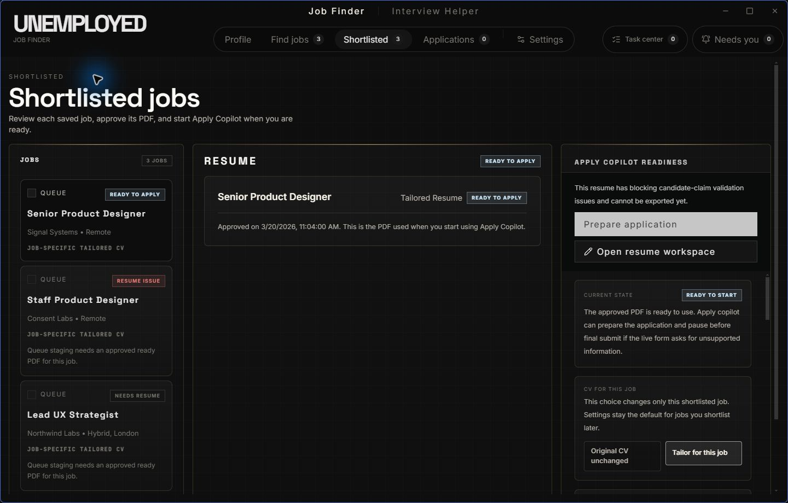

**Reproduction**

1. Open a ready tailored resume.
2. Make and save a grounded manual edit that triggers candidate-claim validation.
3. Activate either export control.
4. Observe no actionable feedback in Resume Studio.
5. Return to Shortlisted and select a different ready job.
6. Observe the previous job's blocking message in the selected job's readiness pane.

**Expected:** Export controls should become visibly disabled when validation blocks export, with a nearby explanation and a direct link to the exact proof/warning item. The message should remain scoped to the affected job.

**Control check:** The same export flow succeeded for an unaffected Senior Product Designer draft, advanced to `Approve this PDF`, and approved correctly. This isolates the issue to validation feedback/state scoping rather than PDF generation.

### CUU-002 — application summary says the CV is attached while recovery says it is not

**Severity:** P1

**Owner:** Applications detail status composition / apply-run artifact result

After safe application preparation stopped before final submit, the top Next step card said: `The approved tailored resume is attached and grounded profile answers are prepared.` Lower in the same selected application, Recovery said: `the approved CV was not attached` and offered `Approve and retry CV attachment`.

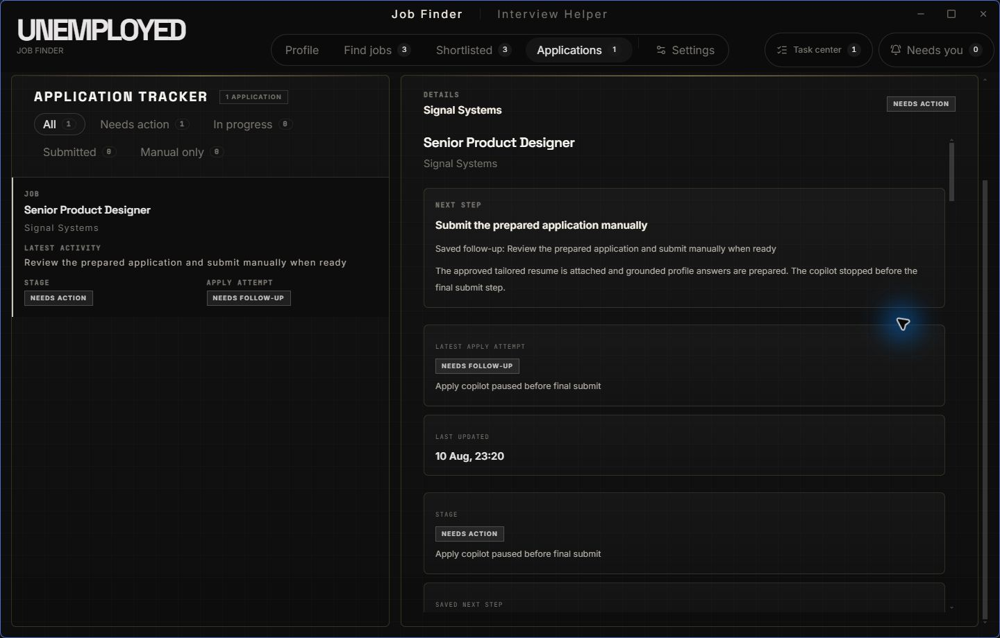

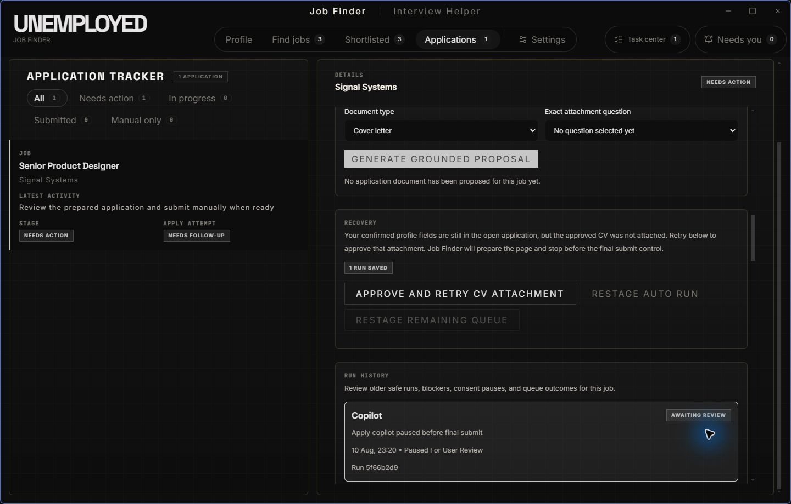

**Impact:** A candidate cannot know whether the packet is actually ready. This is especially risky near a manual final-submit boundary.

**Expected:** Both cards should derive their wording from the retained artifact/attachment outcome. In this case the summary should say the CV is prepared but still needs explicit attachment approval/retry.

### CUU-003 — ended session returns to a stale paused Assist state

**Severity:** P1

**Owner:** Interview Helper session phase/state transition

The disposable session ended and automatically transitioned to a complete Review screen. After visiting Setup and returning to Assist, the screen showed all of these simultaneously:

- `Session paused`
- active-looking `Resume` and `End` controls
- `Start an interview to enable microphone and system audio`
- an empty Recent transcript

Activating Resume produced no visible change.

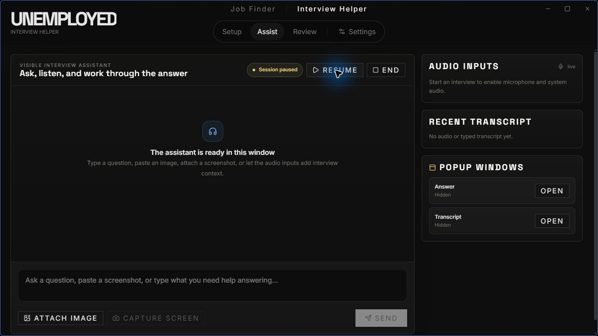

**Expected:** End should clear the active session phase. Assist should show a deliberate inactive state such as `Start a new interview` and `Review the last session`, with no Resume/End controls.

### CUU-004 — OS-closing popup windows leaves visibility state stale

**Severity:** P2

**Owner:** Interview Helper popup BrowserWindow lifecycle

Closing the answer and transcript popup windows with the ordinary Windows `Alt+F4` path removed both windows from the OS window list. The main session health still reported `Both visible`, and Interview Settings still showed both as `Open now` with `Hide` actions. Clicking the in-app Hide controls reconciled the state and changed both actions to Show.

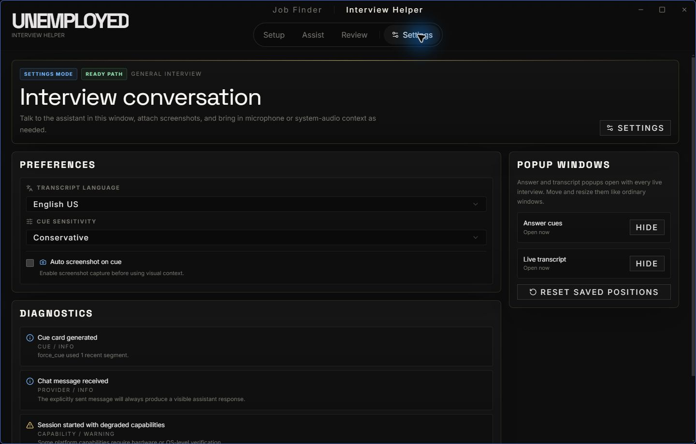

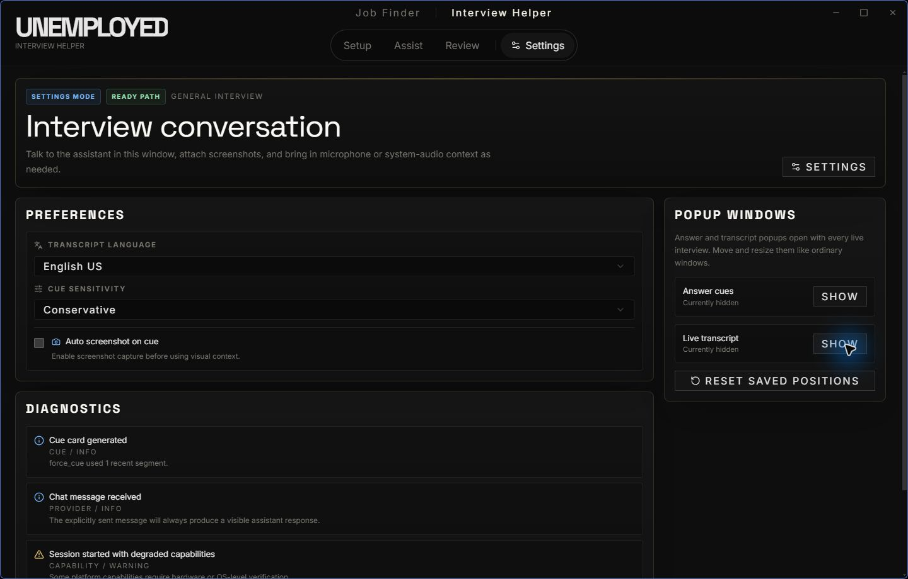

**Expected:** A BrowserWindow close event should update overlay visibility and the health snapshot exactly like the in-popup Hide control. Reopen should remain available from the main window.

### CUU-005 — intentional text-only interviewing is labeled degraded

**Severity:** P2

**Owner:** Interview Helper health model and copy

Microphone, system audio, and screenshots were explicitly left off because they are presented as optional. The typed-question workflow, assistant response, transcript, pause/resume, and Review all worked. Nevertheless, Session health remained `DEGRADED`, with a warning that platform capabilities required hardware or OS verification.

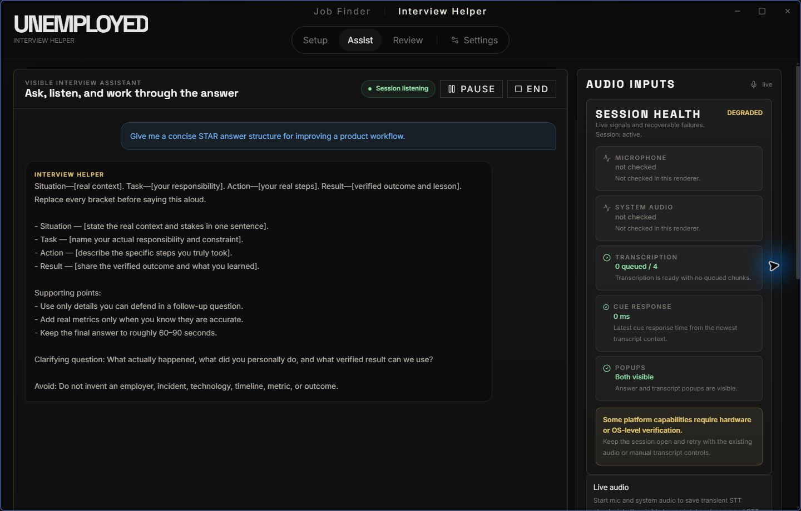

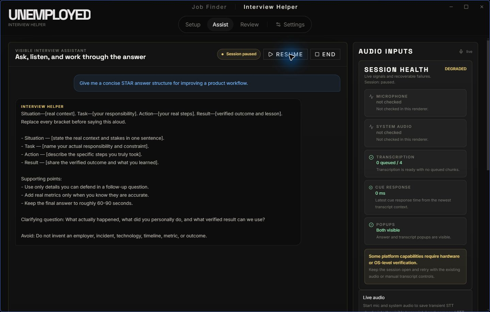

**Expected:** Health should be evaluated against opted-in sources. A supported text-only session could be `Text-only ready`; disabled optional sources should be `Off by choice`, not `not checked` failures.

### CUU-006 — typed question is mislabeled as a meeting transcript in Review

**Severity:** P3

**Owner:** Interview Review transcript source labels

Assist correctly labeled the input as `Typed question`. Review rendered the same item as `meeting native transcript` in the transcript card and annotation selector.

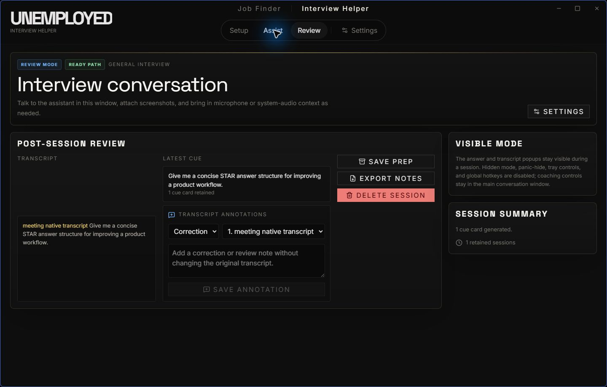

**Expected:** Preserve `Typed question` or another source-accurate label through Review and export.

## User follow-up findings — 2026-08-11

The following findings come from screenshots supplied after the isolated Computer Use pass. They are accepted as real user-observed behavior, but the runtime failures have not yet been independently reproduced or traced to logs. The implementation pass should preserve that distinction: fix the visible product behavior, but diagnose the transport/runtime cause before assigning it to a package or provider.

### CUU-007 — Profile Copilot refuses a simple advisory question

**Severity:** P2

**Owner:** Profile Copilot conversation policy and deterministic/provider response routing

The user asked, `What target role or roles should I use for the job search?` The response said it reviewed the question but could not turn it into a safe structured profile edit. That treats every prompt as a mutation request and does not answer the ordinary question.

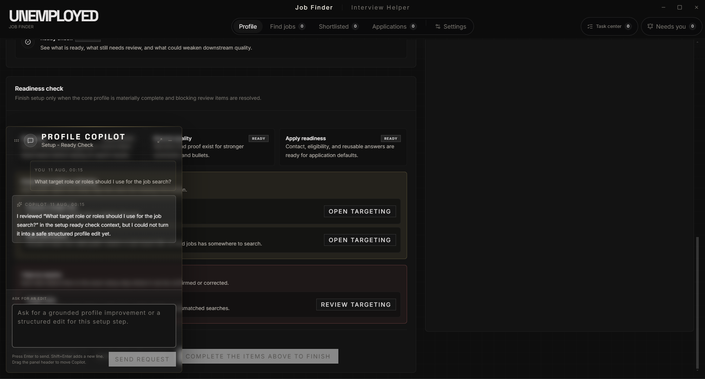

**Expected:** When the user asks for advice or an explanation, answer concisely from grounded profile evidence. If an editable change would help, offer it afterward as an optional review proposal; do not require every message to become a structured edit.

**Fix plan:** Separate conversational intent from edit intent, retain evidence grounding in both paths, and add focused coverage for a plain question, an explicit edit request, an ambiguous request, and an unsupported claim.

### CUU-008 — the default Profile Copilot position covers save/navigation actions

**Severity:** P1

**Owner:** Profile Copilot overlay placement

The default minimized launcher sits directly over the bottom-left Profile actions, including `Save and go back`. The expanded panel covers still more of the readiness area and footer. Dragging makes the controls reachable, but a new user should not need to move the assistant to expose the primary workflow controls.

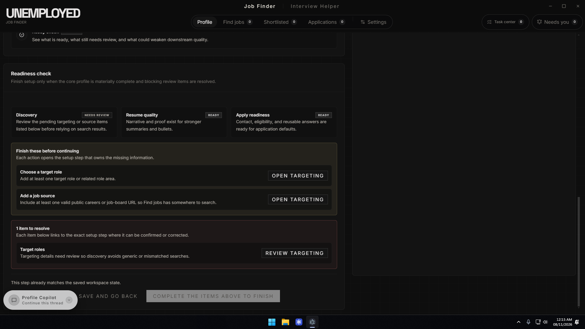

**Expected:** Keep the Profile save/navigation controls in their intentional screen location and make the overlay avoid them. Measure the active workspace action/footer region, select a collision-free default dock, clamp user dragging around it, and restore a saved position only while it remains safe for the current route and window size.

### CUU-009 — right-docked Profile Copilot leaves an excessive edge gap

**Severity:** P3

**Owner:** Profile Copilot drag clamp and dock geometry

When moved right, the launcher stops noticeably short of the window edge. The large unexplained gap makes it look accidentally positioned and consumes useful workspace area.

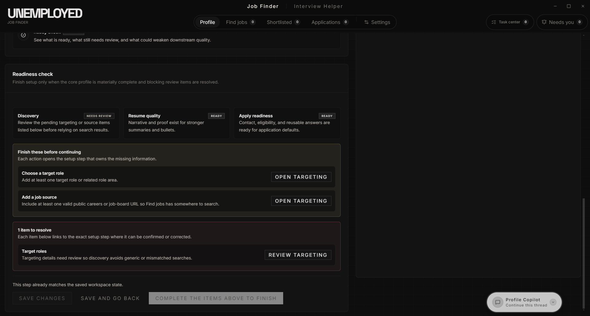

**Expected:** Use one deliberate safe inset—approximately the same visual margin as other floating controls—while still clearing the page scrollbar and window edge. Verify left/right docking at 1366×768, 1440×920, and after resizing.

### CUU-010 — the discovery browser repeatedly opens at one half-screen size

**Severity:** P3, review with live behavior

**Owner:** Browser-runtime window-state persistence

The discovery browser opened at roughly half the display and appeared to return to the same bounds. A side-by-side browser is reasonable, so this is not automatically a defect; the problem is the apparent lack of user-controlled persistence.

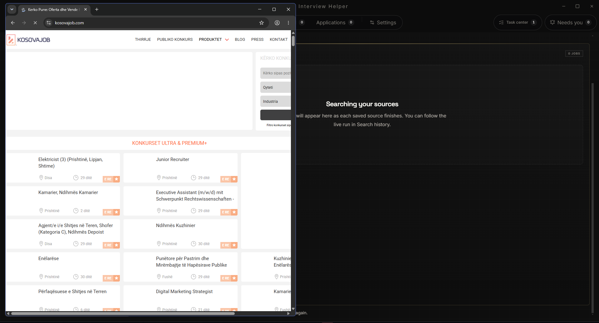

**Expected:** Provide sensible first-launch bounds, then remember the user's last valid size and position. Maximize/restore and moving between displays should remain ordinary native-window behavior, with off-screen recovery when a monitor disappears.

### CUU-011 — live job search reports completion after the LLM transport fails

**Severity:** P1

**Owner:** Discovery orchestration, AI-provider transport classification, and Search History presentation

A single-source search finished with zero jobs and a source warning: `Discovery encountered an error: LLM call failed after 3 attempts: fetch failed`. Search History still labeled the overall run `Completed`, even though the visible browser had listings and the core interpretation step failed.

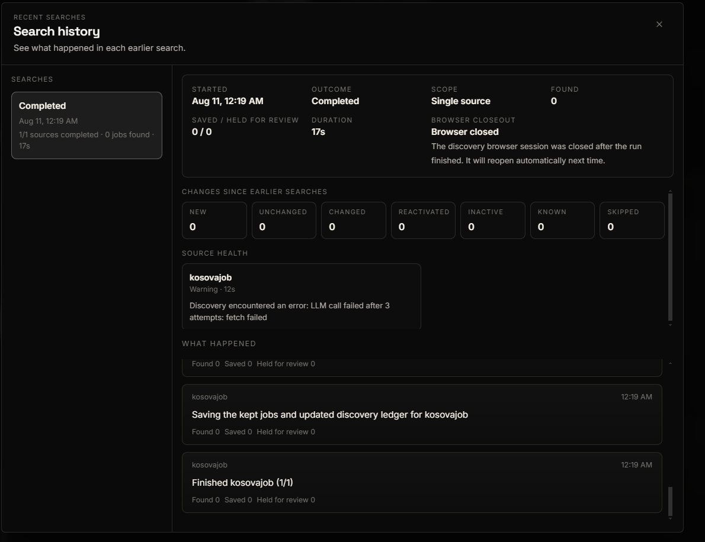

**Expected:** A required interpretation failure should produce an honest `Partial` or `Failed` outcome, retain any safe collected candidates/evidence, identify the retryable layer without exposing secrets, and offer an exact single-source retry. Zero jobs caused by a runtime failure must not look like a valid empty market result.

**Fix plan:** Reproduce with the configured production provider path; correlate the discovery run, provider/bridge transport, and browser-agent logs; distinguish network/TLS, provider configuration, loopback bridge, model availability, and schema failures; then add regression coverage for retry exhaustion and retained partial work. Do not add a KosovaJob-specific rescue branch.

### CUU-012 — Check source fails because the agent runtime fails

**Severity:** P1

**Owner:** Source-debug orchestration, browser-agent lifecycle, and source-check result presentation

Both the KosovaJob and LinkedIn checks ended with `Replay verification did not complete because the agent runtime failed` after 14–16 seconds. The screen continued to present saved guidance as though it came from the latest source check, which can make older retained guidance look newly verified.

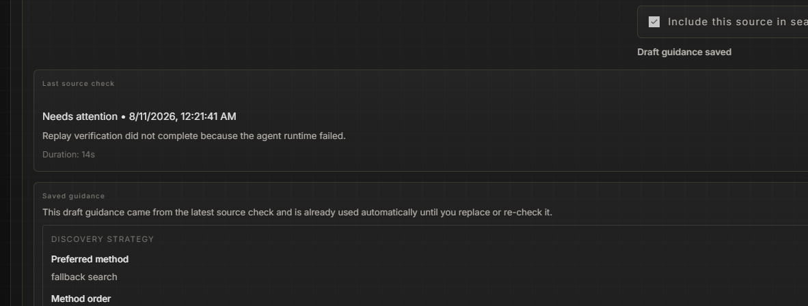

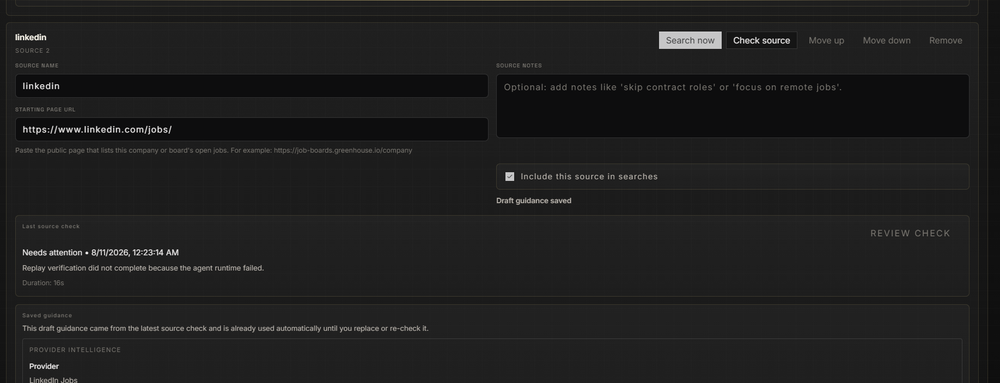

**Expected:** Repair the generic agent-runtime startup/connection/replay path, expose a useful sanitized failure category and retry, and label retained guidance with the timestamp of its last successful verification. A failed check must not refresh provenance or imply that old guidance was just validated.

**Fix plan:** Diagnose the shared runtime once across both sources, preserve the source-generic boundary, add lifecycle and stale-guidance tests, and live-verify at least two structurally different public sources after the fix.

### CUU-013 — a manually entered target role should not block profile-driven discovery

**Severity:** P1 product-flow change

**Owner:** Product readiness rules, targeting contracts, discovery planning, and Profile UI

The current product baseline requires at least one target role before setup or search can continue. The user's intended model is lower-level and profile-driven: the agent already has résumé, experience, skills, seniority, preferences, and exclusions, so it should be able to infer useful search areas without forcing vague job-title guesses.

**Desired direction:** Require a runnable public source, but make explicit titles optional. Derive a small evidence-backed set of search intents from the profile, show them as editable/reviewable suggestions, let the user narrow or override them, and preserve hard preferences and exclusions. Broad mode should search related role families conservatively rather than inventing an unconstrained title list.

**Fix plan:** Update the product/readiness decision first, then the targeting contract, setup blockers, discovery planner, fit tests, Search History scope labels, and migration/default behavior. Preserve typed target instructions and source-generic discovery; do not replace the current requirement with an uninspectable model guess.

## Confirmed strengths

### Independent scrolling behaves as designed

The app intentionally has several scrollable regions on the same screen. Small wheel input was repeated with the pointer deliberately over each region. On Find jobs, the right Job details pane scrolled without moving the search controls or results; the left Current search pane scrolled independently; an area without overflow correctly passed wheel input to the outer page. Large automation deltas were not treated as defects because they can exhaust an inner pane and chain to the parent.

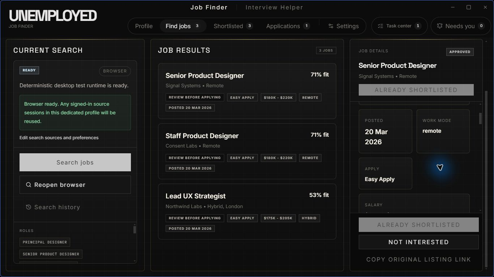

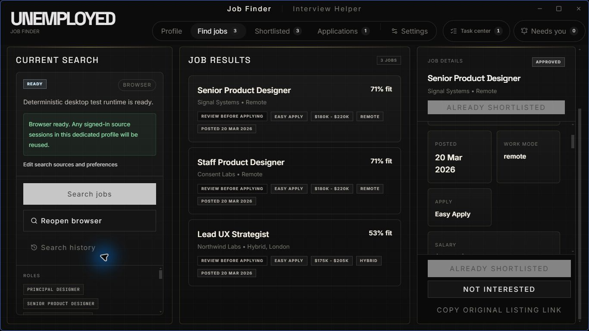

### Resume editing and production PDF export work

The preview-led editor moved from the clicked preview section to the matching editable field, rendered unsaved changes immediately, saved them, and cleared approval as expected. A clean draft then exported and advanced to exact-file approval at 1366×768.

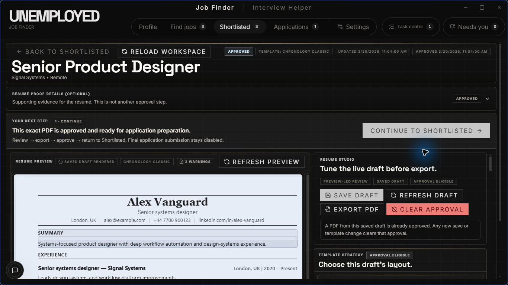

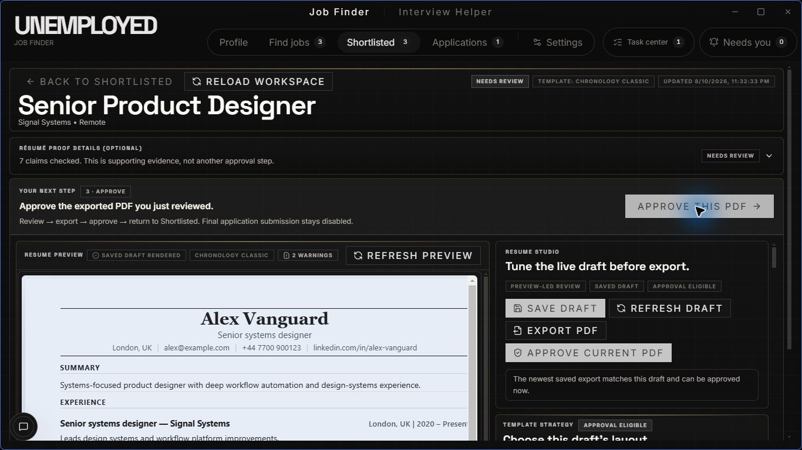

The actual one-page Letter PDF was rendered independently at 144 DPI. It matched the preview, with consistent typography, margins, rules, hierarchy, readable glyphs, no clipping, no overlap, and no broken sections.

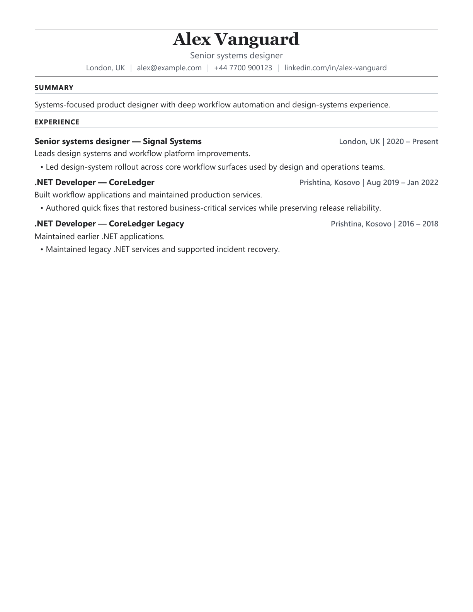

### Application and recovery safety remain visible

Application preparation required an explicit visual-checkpoint choice, stayed in the synthetic workspace, and paused before final submit. The Applications tracker remained readable at 1366×768, and Task Center exposed the paused run without implying final-submit authority.

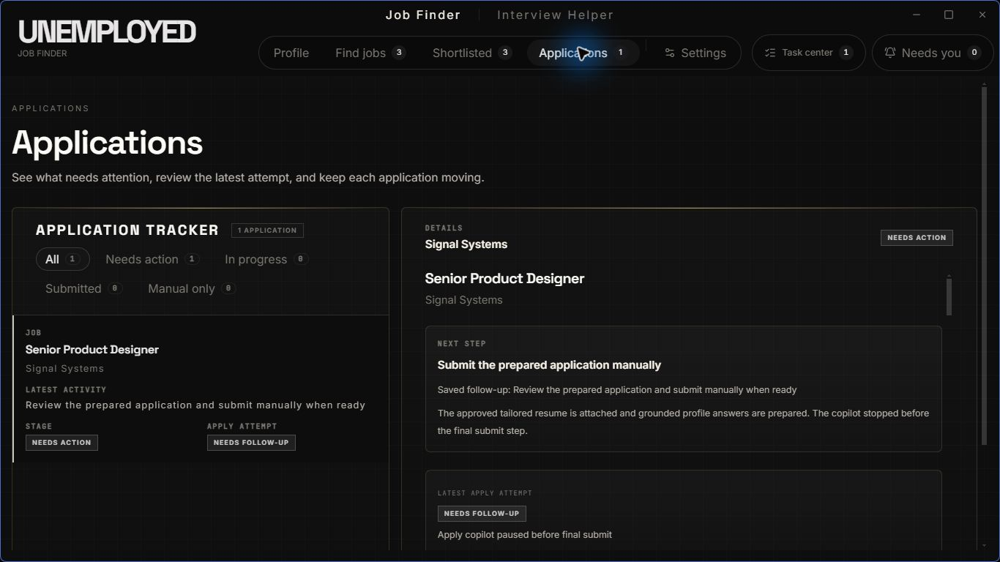

### Interview journey and destructive confirmation work

Setup kept all optional media choices separate and visible. The session accepted a synthetic question, generated a grounded answer with explicit placeholders instead of invented facts, paused/resumed, ended into Review, and preserved the session when the permanent-delete dialog was dismissed with Escape.

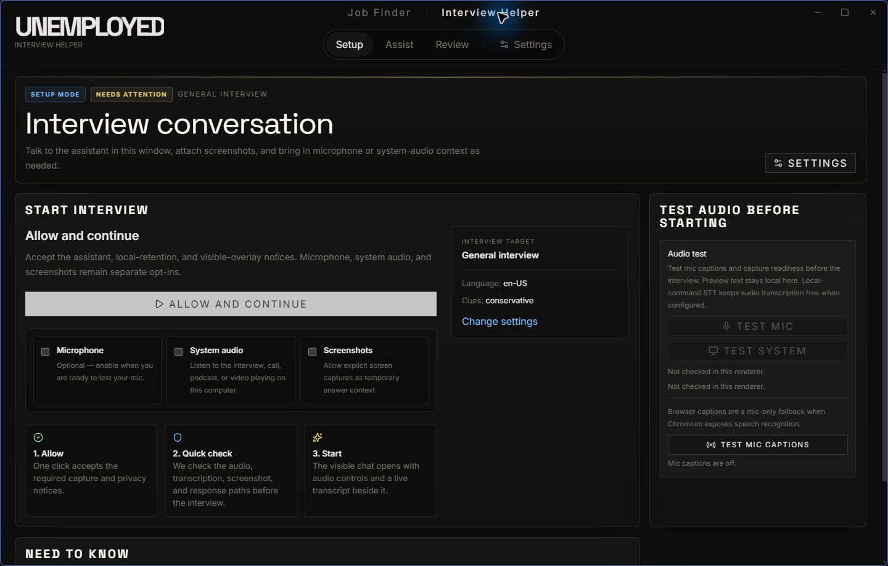

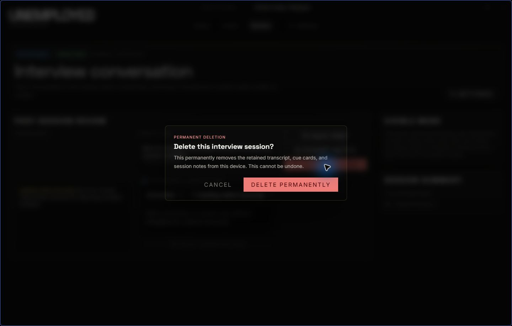

### Settings and reset boundaries are clear

The long Settings page kept editable defaults, local candidate assets, runtime guardrails, diagnostics, performance evidence, and destructive workspace reset visually separated. `Reset everything` is distinctly destructive and was not activated.

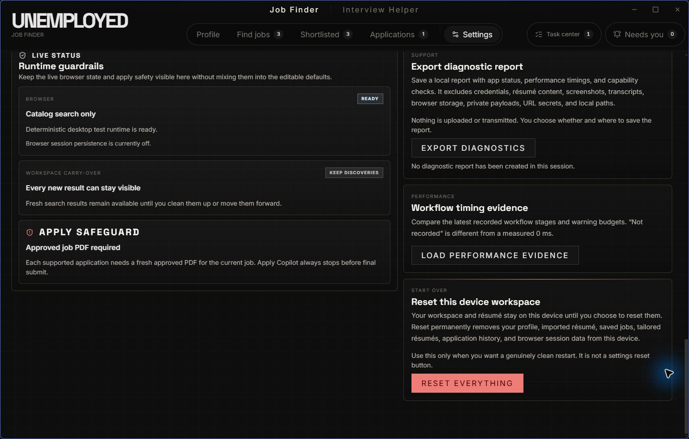

## Evidence limits and intentionally excluded actions

- The app used a fresh isolated profile. Results do not prove migration behavior in a long-lived personal workspace.
- The browser runtime was disabled, so no signed-in source, employer site, CAPTCHA, MFA, account creation, external URL, or final employer control was opened.
- No final application submission, manual-submission marking, destructive workspace reset, asset removal, or permanent session deletion was authorized or performed.
- Microphone, system audio, and screenshots stayed off. Real media-device acceptance remains separate.
- Transparent popup content existed and was readable through the accessibility tree, but Windows Graphics Capture returned blank/underlying pixels for those always-on-top windows. A short human visual check of popup styling is still appropriate.
- This was a built-app acceptance pass, not a packaged installer/update/code-signing smoke.
- macOS header traffic-light spacing was not visually tested on this Windows host.

## Remaining follow-up

1. Re-run Find jobs and Check source through the user's configured live provider/network path. Confirm transport availability, exact retry, and the honest failed/partial history presentation without adding source-specific behavior.
2. Perform the short human visual check of transparent popup styling, which Windows Graphics Capture cannot represent reliably.
3. Keep macOS title-bar/traffic-light layout and real microphone/system-audio acceptance in their platform/hardware gates.

The original 2026-08-10 audit was read-only. Product source changed only in the separately authorized 2026-08-11 remediation pass documented above.
